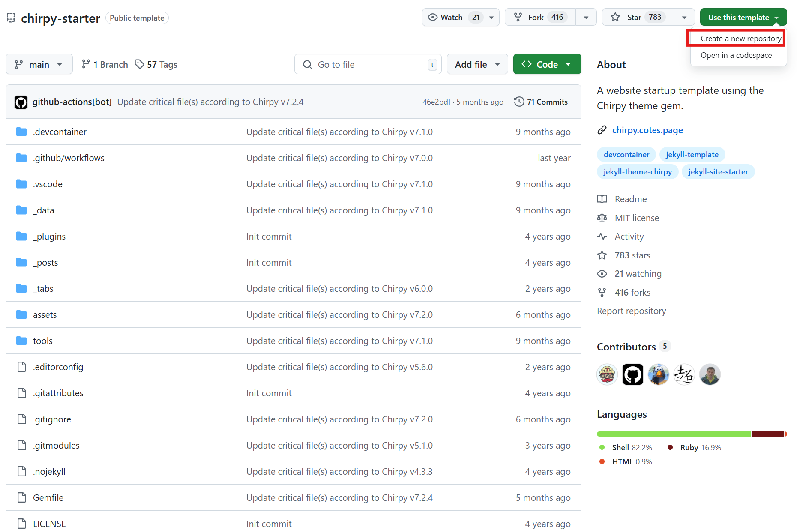
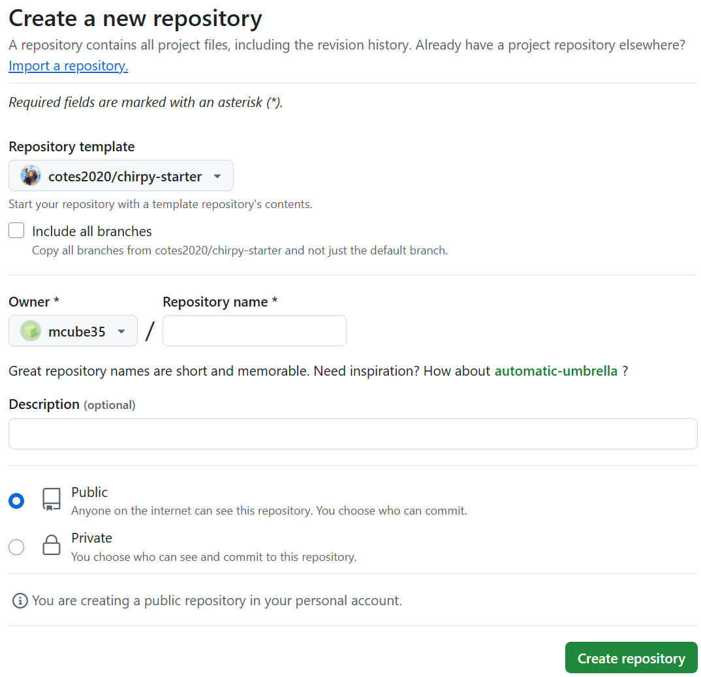
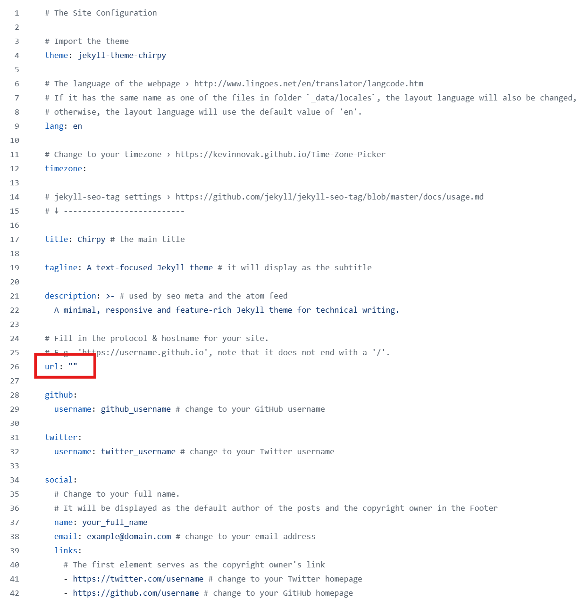
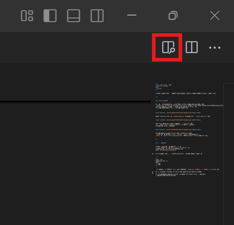

개발하는 과정에서 배우고 지나가는게 좀 아쉽기도해서 기록해서 나중에 보기위해 블로그를 만들기로 했다.


---


## ✅ 블로그 생성하기


우선 처음부터 UI하나하나 다 만드는건 에바라 블로그 템플릿을 다운받아야하기때문에
<a href="https://github.com/cotes2020/chirpy-starter" target="_blank">https://github.com/cotes2020/chirpy-starter</a> 에 들어가서
`Use this template` 를 누르고, `Create a new repository` 을 눌러준다
이 템플릿 외에도 다양한게 있지만 이게 가장 좋아보였다.


&nbsp;&nbsp;


그담엔 `Repository Name` 에 `사용자명.github.io` 을 입력을 해주고 `Create repository` 클릭


&nbsp;&nbsp;


방금 포크한 녀석을 git clone으로 가져와주고 `_config.yml` 에서
`url` 부분을 `https://사용자명.github.io` 으로 넣어주고 push하면
블로그가 해당 주소로 만들어진다.


&nbsp;&nbsp;


블로그가 완성이 되었다면 이제 UI를 커스텀마이징해주면 되는데,
`_config.yml` 에 들어있는 `title`, `tagline`, `avatar` 등을 수정하면 되고
`avatar` 는 `avatar: "assets/img/avatar.png"` 이런식으로 이미지 경로를 추가해주면 된다.


---


## 📝 글 작성하기


블로그를 만들었으니 글을 작성해야할 차례다.
`_posts` 폴더에 `현재년도-현재월-현재일-파일이름.md` 으로
마크다운파일을 생성해주고 vscode로 열어준다.


**예시)** `25-05-03-깃헙블로그생성.md`


열었으면 맨위에다가 아래 내용처럼 추가해준다.


```
---
title: 제목
categories: 카테고리
tags:
 - 태그1
 - 태그2
---
```

만약 상위카테고리, 하위카테고리를 만들어 추가하려면

`categories: [상위카테고리, 하위카테고리]`해주면 된다.

이제 요 아래에다가 문법에 따라 블로그 글을 작성하고나서 push를 해주면 글 작성 완료! 올라가는데 시간이 좀 걸리니 기다려주자


### ❗참고 vscode에서 우측 상단에 요놈을 클릭해주면 우측에 마크다운 미리보기창이 뜬다.


&nbsp;&nbsp;


