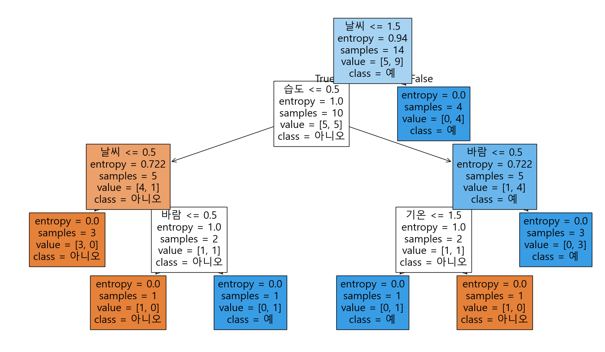

# 📚 의사결정트리 (Decision Tree)

---

우선 설명하기 전에 코드와 실행결과를 봐보자. 아래는 코드와 코드 실행결과다.

```python
import pandas as pd
from sklearn.preprocessing import LabelEncoder

# 데이터 불러오기
data = pd.DataFrame({
    '날씨': ['맑음', '맑음', '흐림', '비', '비', '비', '흐림', '맑음', '맑음', '비', '맑음', '흐림', '흐림', '비'],
    '기온': ['더움', '더움', '더움', '보통', '시원', '시원', '시원', '보통', '시원', '보통', '보통', '보통', '더움', '보통'],
    '습도': ['높음', '높음', '높음', '높음', '보통', '보통', '보통', '높음', '보통', '보통', '보통', '높음', '보통', '높음'],
    '바람': ['약함', '강함', '약함', '약함', '약함', '강함', '강함', '약함', '약함', '약함', '강함', '강함', '약함', '강함'],
    '운동함': ['아니오', '아니오', '예', '예', '예', '아니오', '예', '아니오', '예', '예', '예', '예', '예', '아니오']
})

# 문자형을 숫자로 바꾸기 (Label Encoding)
le = LabelEncoder()
for col in data.columns:
    data[col] = le.fit_transform(data[col])

from sklearn.tree import DecisionTreeClassifier

#학습하기
X = data.drop('운동함', axis=1) 
y = data['운동함']

model = DecisionTreeClassifier(criterion='entropy')  # or 'gini'
model.fit(X, y)


# 시각화하기
from sklearn.tree import plot_tree
import matplotlib.pyplot as plt
import matplotlib
matplotlib.rcParams["font.family"] = "Malgun Gothic"

plt.figure(figsize=(20,10))
plot_tree(model, feature_names=X.columns, class_names=['아니오', '예'], filled=True)
plt.show()
```



---

뭐가 많은데 사진을 보며 하나씩 이해해보자.

## 🌳 의사결정트리란?

의사결정트리는 **운동할까 말까**를 결정하는 **질문 나무**라고 보면 된다.

* **입력**: 날씨, 기온, 습도, 바람
* **출력**: 운동 여부 (`예` 또는 `아니오`)

예시 입력:

```
날씨=맑음, 기온=보통, 습도=높음, 바람=강함
```

이 경우 트리의 흐름은 다음과 같을 수 있다:

```
1. 날씨가 맑음이야? ➡️ 그러면 다음 질문!
2. 습도가 높음이야? ➡️ 그럼 운동하지 마!
```

---

## 🧠 의사결정트리의 작동 원리

* **학습(fit)**: 데이터를 통해 규칙을 만든다 (트리 구조 생성)
* **예측(predict)**: 새로운 데이터가 들어오면 트리를 따라가며 결정한다
* **분기 기준**: 각 노드에서 가장 "정보를 많이 주는" 속성으로 분기

---

## 🧩 노드 구성 요소 해석

트리 시각화에서 각 노드는 다음과 같은 정보를 담고 있다:

```
entropy = 0.918
samples = 10
value = [4, 6]
class = 예
```

### 📉 1. `entropy`

불확실성의 정도를 나타낸다.

* `entropy = 0` ➡️ 하나의 클래스만 있음 → 완전 깔끔
* `entropy = 1` ➡️ 두 클래스가 50:50으로 섞여 있음 → 최대 혼란

수학적으로는 다음과 같다:

$$
H = -\sum p(x) \log_2 p(x)
$$

🔎 예시:

* 어떤 노드에 예: 5, 아니오: 0 → entropy = 0.0
* 예: 3, 아니오: 3 → entropy = 1.0

### 📦 2. `samples`

해당 노드에 도달한 데이터 샘플의 개수.

* 루트 노드는 전체 샘플 수
* 아래로 내려갈수록 줄어든다 (분기되기 때문)

### 📊 3. `value`

각 클래스의 샘플 수를 나타낸다.

예: `value = [2, 4]` 는
→ '아니오': 2개, '예': 4개라는 뜻.

### 🏷️ 4. `class`

가장 많은 샘플을 가진 클래스가 해당 노드의 예측값이 된다.

* `value = [1, 5]` → `class = 예`
* `value = [3, 3]` → 동점일 땐 보통 더 작은 인덱스 선택

---

## ✂️ 분할 기준: 정보를 어떻게 나누는가?

### 📈 정보 이득 (Information Gain)

**“이 질문이 얼마나 혼란을 줄여주지?”** 이걸 평가하는 방식이야.

트리가 새로운 질문을 고를 때, 이렇게 생각하는 거지:

> “지금 데이터를 이 기준으로 나누면, 쪼갠 뒤에는 더 명확해질까?”

### 🎯 예시로 보기 (트리 위쪽 `날씨 <= 1.5`):

* 원래 데이터는 '예'도 있고 '아니오'도 섞여 있어서 헷갈려.
* 근데 `날씨`로 나눠보니까:

  * 한쪽은 여전히 섞였지만,
  * 다른 한쪽은 전부 '예'만 있음 → 완전 깔끔!

이럴 때, **“오! 날씨라는 기준은 꽤 쓸만하군”** 하고 그걸 분할 기준으로 고름.

> 정보 이득은 결국:
> **“이걸로 나누면, 얼마나 상황이 덜 헷갈려졌는지”의 점수**

---

## 🧪 지니 불순도 (Gini Impurity)

이건 약간 다르게 접근해.
**“여기서 무작위로 하나 뽑으면, 잘못 분류될 확률이 얼마나 될까?”**

* 만약 전부 '예'면 → 틀릴 확률 0 → 지니 값 0 (아주 좋은 상태)
* 반반 섞여 있으면 → 헷갈릴 확률 최대 → 지니 값 높음

### 🎯 예시로 다시 보기:

* `value = [5, 5]` → 반반 → 제일 불확실함
* `value = [0, 4]` → 전부 '예' → 아주 명확함 (지니값도 낮음)

---

## 🔄 정보 이득 vs 지니 — 느낌 비교

| 느낌    | 정보 이득                 | 지니 불순도                   |
| ----- | --------------------- | ------------------------ |
| 평가 방식 | “질문 후, 얼마나 깔끔해졌나?”    | “지금 이 상태, 얼마나 헷갈리는가?”    |
| 예시    | 나누기 전후의 차이를 본다        | 지금 이 상태의 혼란도를 본다         |
| 기본값?  | `criterion="entropy"` | `criterion="gini"` (기본값) |

---

### 📌 다시 트리로 돌아가서 보면...


* 루트 노드에서 `날씨`를 기준으로 나눈 이유?
  → **정보 이득이 가장 컸기 때문** (가장 덜 헷갈리게 쪼갤 수 있었던 질문이니까!)

* 아래쪽으로 내려가며 계속해서
  → **가장 명확하게 나눠주는 속성**을 찾아간 것.

---

## 🌿 노드의 종류

* **루트 노드**:
  트리의 시작점이자 **첫 질문**
  예제에선 `날씨 <= 1.5`

* **내부 노드**:
  중간의 **조건 검사** 노드들
  데이터가 계속 갈라지는 지점
  예: `습도 <= 0.5`, `바람 <= 0.5` 등

* **리프 노드**:
  **더 이상 질문 없음**, **예측값 결정**
  예: `class = 예`, `class = 아니오`로 끝나는 곳

---

## ⚠️ 오버피팅과 가지치기 (Pruning)

**문제**: 트리가 너무 깊어지면 학습 데이터엔 잘 맞지만 새로운 데이터에선 잘 동작하지 않음 → **오버피팅**

**해결**: 가지치기(pruning)

* **사전 가지치기 (Pre-pruning)**: 트리를 만들면서 미리 깊이 제한, 최소 샘플 수 제한 등 적용
* **사후 가지치기 (Post-pruning)**: 트리를 다 만든 뒤, 성능 향상이 없는 노드는 잘라냄

```python
DecisionTreeClassifier(max_depth=3, min_samples_split=5, ...)
```

을 활용하면 과적합을 방지할 수 있다.

---

## 🔚 마무리 요약

* 의사결정트리는 **조건문 기반의 트리 구조**
* 각 노드는 **특성값을 기준으로 데이터를 나누고**, **불확실성을 줄이는 방향**으로 분기함
* 주요 개념: `entropy`, `information gain`, `gini`, `samples`, `value`, `class`
* 과적합을 방지하려면 **가지치기**를 고려해야 한다

---