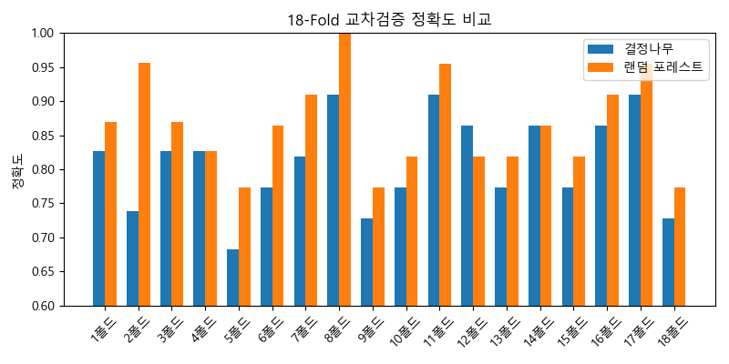

# 🌳 랜덤 포레스트 (Random Forest)

랜덤 포레스트는 여러 개의 결정나무를 조합해  
**예측 정확도와 안정성을 높이는 앙상블 학습 기법**이다.  
회귀와 분류 모두에 사용되며, **과적합에 강한 특성**을 가진다.

이 모델은 **배깅(Bagging)**이라는 전략을 기반으로 작동한다.

### 📦 배깅(Bagging)이란?

> **서로 다른 데이터 샘플로 여러 모델을 학습시킨 뒤**,  
> **그 예측 결과를 평균 또는 투표로 합치는 방법**  
> → 과적합을 줄이고, 더 안정적인 예측이 가능하다.

---

## 🧪 경험: 직접 해보고, 눈으로 느껴보기

머신러닝 모델은 써보기 전까진 그 차이를 느끼기 어렵다.  
**랜덤 포레스트는 단일 결정나무의 약점을 보완한 모델**이라 불리지만,  
말만 듣고는 얼마나 다른지 감이 잘 오지 않는다.

그래서 먼저,  
**같은 데이터에 두 모델을 적용해 보고**,  
그 차이를 직접 체험해보자.

```python
from sklearn.datasets import make_moons
from sklearn.model_selection import StratifiedKFold
from sklearn.ensemble import RandomForestClassifier
from sklearn.tree import DecisionTreeClassifier
from sklearn.metrics import accuracy_score
import matplotlib.pyplot as plt
import numpy as np

plt.rcParams["font.family"] = "Malgun Gothic"

# 1. 데이터 생성
X, y = make_moons(n_samples=400, noise=0.35, random_state=42)

# 2. 모델 정의
tree = DecisionTreeClassifier(max_depth=5, random_state=0)
forest = RandomForestClassifier(n_estimators=100, oob_score=True, random_state=0)

# 3. 18-Fold 교차검증
tree_scores = []
forest_scores = []

cv = StratifiedKFold(n_splits=18, shuffle=True, random_state=42)
for train_idx, test_idx in cv.split(X, y):
    X_train, X_test = X[train_idx], X[test_idx]
    y_train, y_test = y[train_idx], y[test_idx]

    tree.fit(X_train, y_train)
    forest.fit(X_train, y_train)

    tree_scores.append(accuracy_score(y_test, tree.predict(X_test)))
    forest_scores.append(accuracy_score(y_test, forest.predict(X_test)))

# 4. 평균 정확도 출력
print("결정나무 평균 정확도:", np.mean(tree_scores))
print("랜덤 포레스트 평균 정확도:", np.mean(forest_scores))

# 5. 시각화
labels = [f"{i+1}폴드" for i in range(18)]
x = np.arange(18)
width = 0.35

plt.figure(figsize=(8, 4))
plt.bar(x - width/2, tree_scores, width, label='결정나무')
plt.bar(x + width/2, forest_scores, width, label='랜덤 포레스트')
plt.xticks(x, labels, rotation=45)
plt.ylim(0.6, 1.0)
plt.ylabel("정확도")
plt.title("18-Fold 교차검증 정확도 비교")
plt.legend()
plt.tight_layout()
plt.show()
````



> **교차검증 시각화:**
> 랜덤 포레스트는 일부 폴드를 제외하면 **대체로 결정나무보다 우수하며**,
> **평균적으로 더 신뢰할 수 있는 성능**을 보여준다.

---

## 🧠 개념: 결정나무와 랜덤 포레스트의 차이

> 랜덤 포레스트는 **항상 이기진 않지만**,
> **꾸준히 잘한다.** → 그래서 **신뢰할 수 있다.**

### 🎯 사고 방식의 차이

* **결정나무**: 하나의 관점으로 깊게 파고듦
  → 학습 데이터에 특화되어 잘 맞추지만, 새 데이터엔 쉽게 흔들릴 수 있음

* **랜덤 포레스트**: 여러 관점을 얕게 보고 합의
  → 덜 민감하지만, 평균적으로 더 안정적이고 일반화에 강함

> 📌 비유하자면:
> “혼자 정답 외운 사람” vs “서로 토론해서 판단한 사람들”

---

## 🌲 랜덤 포레스트 작동 방식

1. **여러 개의 결정나무를 학습시킨다**
2. 각 나무는 서로 다른 **부트스트랩 샘플**을 학습

   * 전체 데이터에서 **중복 허용**하여 무작위로 샘플링
3. 각 노드는 전체 피처 중 일부만 랜덤 선택해 분할
4. 예측 시, 모든 나무의 결과를 **투표**(분류) 또는 **평균**(회귀)

---

## 🧾 용어 설명

### 🔸 샘플링 (Sampling)

* 전체 데이터 중 일부를 뽑는 것
* 랜덤 포레스트는 **중복 허용** 무작위 샘플링을 사용 → 이를 **부트스트랩 샘플**이라 함

> 예: \[A, B, C, D, E] → \[B, C, C, D, A]

### 🔸 OOB (Out-of-Bag)

* 부트스트랩 샘플에 **선택되지 않은 데이터**
* 해당 나무는 이 데이터를 **본 적이 없으므로**, 마치 검증 데이터처럼 활용 가능
* 랜덤 포레스트는 각 나무의 OOB 예측을 평균내어 전체 모델의 성능을 추정할 수 있음

---

## ✅ 장점 요약

* 과적합에 강함 (다양한 나무들이 존재하므로)
* 일반화 성능 우수 (앙상블 투표/평균)
* 피처 중요도 확인 가능 (`.feature_importances_`)
* 별도 검증셋 없이 `OOB 점수`로 성능 측정 가능
* 병렬 처리에 적합함 (트리 개별 학습 가능)

---

## 🔑 핵심만 기억하면

* 랜덤 포레스트는 **배깅(bagging) 기반의 앙상블 모델**
* 핵심은 **부트스트랩 + 랜덤 피처 선택**
* 예측은 **투표 or 평균**
* **다양성이 곧 성능이다**

---